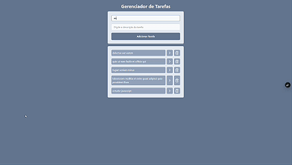

# Lista de Tarefas (React)

Uma aplicação simples de lista de tarefas (To-do List) construída com React. Projeto pensado como exercício/prática para demonstrar fundamentos de React, gerenciamento de estado e persistência local.



## Tecnologias

- React
- JavaScript (ES6+)
- CSS

## Funcionalidades

- Adicionar, editar e remover tarefas
- Marcar tarefas como concluídas
- Persistência no LocalStorage

## Como rodar localmente

```code
git clone https://github.com/leopinheirosilva/lista-tarefas-react.git

cd lista-tarefas-react

npm install

npm run dev
```

## Deploy

- Vercel

Clique [aqui](https://lista-tarefas-react-tawny.vercel.app/) para acessar o site!

## Contato

Email: <leonardopinheirosilva16@gmail.com>

LinkedIn: <https://www.linkedin.com/in/leonardo-pinheiro-13ba26281/>
